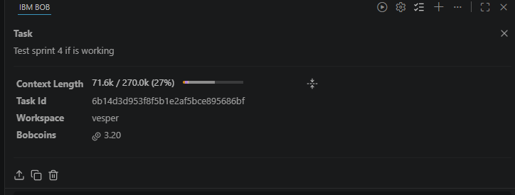

# Petclinic Sprint 4 — Repair and verify

Status: candidate verified locally with documented exclusions; approved by the developer; not integrated into Petclinic.

[Full report and raw evidence](../evidence/petclinic-sprint4-20260926/README.md)

The candidate changes one condition in PetValidator: require a non-null type for existing pets as well as new pets. The original source is pinned to `818c4136ea971c21674525f9053de0d9c7ad8cfe`.

Fresh baseline: 72 passed, 2 skipped. The supplied two-test reproducer failed twice on the original and passed unchanged on the candidate. Candidate full regression: 74 passed, 2 skipped, zero failures/errors; all baseline test identities and statuses preserved.

The two Docker-dependent skips and the unexecuted Postgres suite are excluded coverage. The supplied test fails the formatting gate, so reproduction and candidate verification use `-Dspring-javaformat.validate.skip=true`; assertions and test bytes remain unchanged. The supplied test hash differs from the earlier pasted report; see the full report for both values. No database-write failure or new upstream vulnerability is claimed.

[Exact candidate patch](../evidence/petclinic-sprint4-20260926/candidate.patch)

The isolated candidate source remains at `C:/Users/LEARNER/Documents/ChatGPT/Personal Project/petclinic-sprint4-work/candidate`. This milestone was executed in Codex. The developer approved this candidate and publication on a separate Vesper branch. The developer subsequently supplied the actual Bob task-summary screenshot linked below. Petclinic integration remains a separate action.

[Developer approval and exact patch hash](../evidence/petclinic-sprint4-20260926/approval.json).

## Bob session evidence

Task: "Test sprint 4 if is working". Workspace: `vesper`. Recorded consumption: **3.20 Bobcoins**, as displayed in the supplied screenshot.
