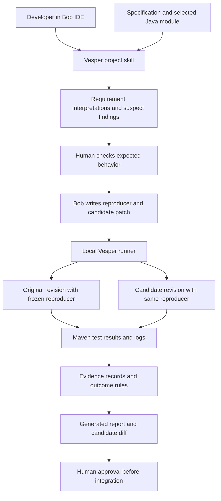

# Vesper — system design v1

Date: 2026-09-25. Status: proposed implementation design for the user-approved product direction. No application has been implemented or run. Prepared using the product-partner skill; no new council run was necessary. Prior council constraints are retained.

## 1. Product contract

Vesper helps a developer review one Java module against a short specification, reproduce supported findings, and evaluate proposed repairs. Its output is an evidence report rather than a list of unverified AI allegations.

Promise: every confirmed finding links to an approved requirement interpretation and a reproducible failing test; every verified repair links to the unchanged test passing and recorded regression results. This is test evidence, not formal proof or a guarantee of application correctness.

First user: a developer maintaining an unfamiliar codebase. First use: review a selected module containing a few business rules. First milestone: one complete requirement → finding → original failure → candidate repair → regression result → human decision loop.

## 2. Architecture decision

Build a local Bob-native workflow with a small Python runner and generated Markdown/HTML evidence report. Use the project's existing Java/Maven test stack, preferably JUnit for the supplied demo. No web service, database, model-provider account, external agent framework or MCP server is needed for v1.



Arrows show responsibilities and artifact flow; they do not imply a headless Bob API. Bob follows skill instructions and invokes local commands through its terminal tool. The developer starts/continues the workflow inside Bob. The runner does not call Bob or independently orchestrate model sessions.

## 3. Components and ownership

| Component | Responsibility | Cannot establish by itself |
| --- | --- | --- |
| Bob project skill | Read spec/code; draft requirements, suspects, tests and explanations; propose fixes | Whether a command ran successfully |
| Python CLI | Validate inputs, prepare workspaces, invoke fixed test commands, record attempts, derive run status | Whether a business expectation is semantically correct |
| Maven adapter | Locate fresh Surefire reports, expected test IDs, failures/errors/skips and process outcome | That an exception represents the alleged bug |
| Evidence store | Preserve revision, test/spec hashes, inputs, logs and outcomes per attempt | Tamper-proof provenance against a malicious local user |
| Report renderer | Show observed results, proposed explanation, scope and diff links | Approve or apply changes |
| Developer | Approve interpretation/test validity and candidate diff | Exhaustive correctness from a finite suite |

Use Python standard-library facilities where feasible: subprocess execution, JSON, hashing, filesystem handling and report templates. The target app remains Java; runner language is independent. Pin the target's JDK/Maven/test dependencies after verifying the selected repository. Java 17 is a proposed demo default, not a checked installation requirement.

## 4. Bob integration

Proposed project location: `.bob/skills/vesper/SKILL.md`, with supporting workflow instructions and JSON examples. IBM documents this project-skill mechanism. Reviewer/test-writer/debugger are task roles expressed in instructions, not assumed built-in Bob agent types.

Start with one sequential Bob session. After one complete loop works, optionally delegate read-only module reviews. A maximum of two concurrent proving jobs is a later experiment, conditional on genuinely separate writable directories and resource capacity. Fixing and integration remain sequential.

Skill instructions must require Bob to:
- Read only the selected scope plus necessary dependencies; disclose extra files examined.
- Cite the specification section behind each expectation and stop when it is ambiguous.
- Write proposals to proposal files, never invent runner results or human approvals.
- Keep accepted reproducer code unchanged during repair.
- Use recorded command results when reporting success.
- Pause the loop when its investigation budget is exhausted.

Bob tools have configurable approval settings. For this design, edits in a disposable candidate workspace may occur during investigation; integration into the accepted source requires review of the exact patch. Tool permission, expectation approval and patch approval are distinct events. Skill instructions are not a filesystem security boundary.

## 5. Repository layout

Suggested submission layout, not yet created:

```text
vesper/
  .bob/skills/vesper/       # Bob workflow and role instructions
  vesper/                  # Python runner package
    cli.py
    workspace.py
    records.py
    maven.py
    outcomes.py
    report.py
  demo/                       # supplied standalone Java/Maven app
    pom.xml
    requirements.md
    src/main/java/
    src/test/java/
  tests/                      # runner behavior and result-parsing checks
  docs/                       # usage, scope, limitations, data provenance
  bob_sessions/               # actual participant task-summary PNGs
  evidence/                   # curated, reviewed demo evidence for submission
  .vesper/                 # ignored local attempts and temporary workspaces
  README.md
```

Keep intentionally seeded bug descriptions/answer keys out of the discovery context when measuring recall. A disclosed demonstration can use seeded defects; do not present these as organic findings.

## 6. End-to-end sequence and acceptance gates

### A. Establish the baseline

Resolve the selected repository and commit. Require a clean accepted source tree or an explicitly recorded snapshot; never silently discard the user's edits. Record spec hash, module scope, tool versions and configured test command. Run the existing suite on that revision. Reject zero-test/skipped-only runs. If the baseline fails, show a baseline blocker and repair/select a suitable target before evaluating new findings in v1.

### B. Interpret requirements

Bob drafts at most five requirement records with source section, plain-language behavior, examples and ambiguity notes. The developer approves the interpretation. This is a review checkpoint over meaningful behavior, not repeated permission for routine reads.

### C. Review selected code

Bob proposes at most three unique suspects. Each needs requirement ID, exact revision/file/symbol, observed code reasoning and a proposed input/expected outcome. Dedupe findings about the same rule/cause; multiple tests do not automatically mean multiple bugs.

### D. Create and validate the reproducer

Generate the test in an isolated baseline workspace. In v1, allow changes only under the designated new-test path; no application, dependency or build-file changes. If reproduction needs a new dependency or harness, classify it as unsupported scope rather than silently changing the evaluation environment.

Check that the expected result follows the approved rule. Run the targeted test and retain its XML/logs. A discovered application assertion failure with a valid expectation is eligible for confirmation. Compilation/setup failures are execution or test-construction problems. Unexpected exceptions need explicit classification; neither all exceptions nor all assertion failures automatically prove a defect.

For a confirmed demo finding, repeat the baseline reproduction twice. Preserve all attempts. A pass/fail disagreement is flaky/inconclusive. Snapshot and hash the accepted test bundle and relevant build configuration after validation.

### E. Propose and verify repair

Create a candidate workspace from the same baseline and add the same frozen test bundle. Bob edits only scoped application source. The runner checks changed paths and hashes before evaluation. It rejects changed tests, skip directives, changed dependencies/build configuration, missing expected test IDs or unsupported edits.

Run the targeted reproducer on the candidate, then the full declared regression suite including the new test. Compare expected existing test IDs as well as totals so removed/disabled tests cannot manufacture a pass. Store before/after source and test hashes. Repeat the final demo verification enough to establish the planned three complete rehearsals; do not report unperformed repetitions.

### F. Human decision and integration

Render the exact candidate diff with evidence. Approval applies to its hash; any later patch change invalidates that approval. In v1, integration is a manual action rather than an automatic merge feature. After integration, run the suite again on the resulting accepted revision. Distinguish verified candidate, approved patch and verified integrated result.

With multiple findings, preserve each finding's original evidence. Before integrating a later patch, rebase/recreate it against the current accepted revision and rerun its checks; do not reuse stale green results. If an earlier fix resolves another suspicion, record it as resolved by that change and avoid double counting.

## 7. State model

Run states: `created`, `baseline_check`, `awaiting_expectations`, `reviewing`, `investigating`, `report_ready`, `blocked`, `interrupted`.

Keep finding dimensions separate instead of forcing all outcomes into one success flag:

| Dimension | Values |
| --- | --- |
| Investigation | suspected, needs_clarification, invalid_test, environment_error, not_reproduced, flaky, reproduced |
| Repair | not_attempted, proposed, verification_failed, regression_passed |
| Approval | pending, approved, rejected |
| Integration | not_integrated, integrated_unverified, verified, failed |

Only a valid, repeatable, requirement-linked failure can reach `reproduced`. `regression_passed` requires the unchanged targeted test and the declared regression suite to have actually executed successfully. Passing does not imply approved; approved does not imply integrated. Unresolved investigations stay visible but outside the confirmed-bug list.

## 8. Data and command contracts

The initial interchange format is versioned JSON. These are proposed contracts, not implemented APIs.

- **Run:** schema version, run ID, source revision, spec hash, scope, environment versions, start/end time, limits and status.
- **Requirement:** ID, source section, interpretation, examples, ambiguity and human review record.
- **Finding:** ID, requirement IDs, code location/revision, hypothesis, severity rationale, investigation/repair/approval/integration states.
- **Attempt:** unique ID, finding ID, role (baseline reproduction/candidate/regression/integration), workspace revision, test/build hashes, command arguments, timestamps, exit code, timeout flag, expected/discovered test IDs, result counts, artifact paths and classification.
- **Patch:** baseline revision, source diff hash, allowed changed paths and candidate identity.
- **Decision:** expectation or patch hash, approve/reject decision, timestamp and developer-entered identity. This is local workflow bookkeeping, not authenticated audit infrastructure.

Runner-generated evidence is separate from Bob's proposal JSON. Store each attempt in its own directory; write completed records atomically. A single runner owns each run with a lock. On interruption, retain logs and mark the attempt interrupted; resume with a new attempt, never promote partial output into success. JSON files and attempt directories suffice; no event-sourcing platform is required.

Suggested commands: `init`, `baseline`, `import-proposals`, `record-expectation-decision`, `reproduce`, `verify-candidate`, `report`, `record-patch-decision`, `verify-integrated`. Exact syntax will be fixed during implementation. Decision commands are developer-operated; the runner must not infer consent from Bob-generated files. In a shared local account this convention is not adversary-resistant and must not be marketed as such.

## 9. Execution boundaries and error handling

Only run a developer-selected trusted local repo; no arbitrary uploads or network cloning feature in v1. Build scripts are executable code. Workspaces separate file changes but do not sandbox the operating system. Run without customer data or production credentials.

Invoke configured executables with argument arrays, not an AI-supplied shell string. Handle Windows Maven wrappers explicitly. Validate path containment and reject traversal/symlink escapes in imported proposals. Candidate source changes are checked by the runner. Report templates escape code/log text and render no executable content.

Every invocation gets a fresh output directory and cleared/recreated test-report location. Track expected tests, skips, malformed XML, nonzero process exits and missing reports. Implement timeout/process-tree termination appropriate to the actual host; do not assume terminating only the parent Maven process stops forked JVMs. Cap captured output while retaining a clear truncation marker.

On CLI crash or stale lock, require a verified inactive process before recovery. Never automatically delete the user's source or all worktrees. Cleanup applies only to runner-owned paths after containment checks.

## 10. Report and interaction design

Bob conversation is the primary control surface. The generated report is read-only: summary, requirement list, confirmed findings, unresolved attempts and candidate diffs. No pretend approve button in static HTML; approval is explicitly recorded by the developer.

Each confirmed card shows requirement/source, failing input, expected/actual result, source location, original failing run, candidate passing run, regression scope, changed files and current approval/integration state. Include raw evidence links and an explicit “behavior outside these checks was not verified” note.

Summary counts: unique suspects, reproduced bugs, not reproduced, invalid/environment/flaky outcomes, regression-passing candidates, approvals and integrations. Time includes setup/approval/retries; stage timings are separately available. Bobcoin usage is manually transcribed from actual Bob summaries unless a supported export is verified. Never estimate consumption from agent count.

## 11. Resource limits and hackathon fit

Proposed initial limits: five requirements, three suspects, one running proof job, two test-construction attempts per suspect, two repair attempts per confirmed finding. Increase concurrency only after measurement. Use a configurable per-command timeout selected after the baseline; cold dependency installation must be distinguished from warm test execution. No promised speedup.

The supplied September 24 organizer email says Bob IDE is required, task-summary screenshots belong in `bob_sessions`, the hackathon account supplies 40 Bobcoins, and data restrictions exclude personal/confidential/social-media data. Use synthetic fixtures and keep any external-code/data provenance. Reserve part of the available Bob allowance for repairs and the final recorded demonstration; no reliable per-stage coin estimate exists yet.

Updated setup status: registration is approved; Bob IDE is installed and the user is signed in. The official guide and deadline have been verified (see event-requirements.md). Hackathon account selection, remaining Bobcoins and the Java/Maven toolchain still need checking.

## 12. Implementation order and verification

1. **Capability check:** Bob recognizes the project skill, can read the spec, invoke a local command and expose its task summary. Standalone target tests execute without server/database.
2. **Runner foundation:** baseline, isolated workspace, invocation/result parsing and per-attempt records. Verify zero tests, skip-only, missing/stale reports, timeout and nonzero exit cannot pass.
3. **One bug:** approved expectation, valid reproducer failing on original, frozen-test guard, candidate repair and regression evidence.
4. **Report:** cards and raw links; show not-reproduced and invalid attempts honestly.
5. **Small expansion:** up to three distinct disclosed seeds; then optional bounded review fan-out. Manual integration and revalidation.
6. **Submission rehearsal:** three complete rehearsals, short demo recording, screenshots, README, reproducibility and data provenance.

Essential adversarial checks: modified assertion rejected; disabled/deleted test rejected; setup failure not a bug; stale output not fresh evidence; partial rerun not full regression; later diff invalidates approval; combined patches reverified. Also review tests for hard-coded implementation details, swallowed exceptions and incorrect expected outcomes; hashes cannot detect semantic mistakes.

Two-minute demo: show a requirement and selected module; start investigation; show the original failure; inspect the candidate change; show unchanged test/regression results and pending approval. Clearly label prerecorded material and seeded bugs. No fabricated outcomes or manufactured organic discoveries.

Fallbacks: if automatic discovery is unreliable, accept a developer-supplied suspicion while preserving reproduction/repair; if orchestration is unreliable, keep sequential Bob steps; if the repo requires external services, replace the target rather than expanding infrastructure.

## 13. Sources and decision rationale

- [IBM Bob skills](https://bob.ibm.com/docs/ide/features/skills): supports project workflow files under `.bob/skills`; basis for native integration.
- [IBM Bob approvals](https://bob.ibm.com/docs/ide/features/auto-approving-actions): tool permissions are configurable; separate them from product-level diff acceptance.
- [Maven Surefire](https://maven.apache.org/surefire/maven-surefire-plugin/): unit-test execution produces text/XML reports; basis for the test adapter.
- [Git worktree](https://git-scm.com/docs/git-worktree): separate linked working trees are available. Implementation may use detached worktrees for a pinned commit; these are change isolation, not a security sandbox.

No additional council: the design adopts the already-reviewed narrow scope and retains its evidence/approval constraints. The first local integration trial is more useful than another conceptual vote. Escalate only if scope changes to arbitrary untrusted repos, hosted execution, automatic merging or another consequential capability.

