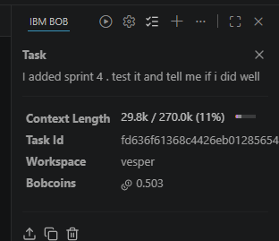

# Sprint 4 evidence

[Open the verified manual-run report](workflow-20260925-231048-a534f44c/report.md).

This folder preserves the actual run supplied by the developer: 12 baseline tests passed, the seeded R3 defect reproduced twice, the candidate reproducer passed, and all 12 regression tests passed. Total recorded duration: 58.724 seconds.

Logs, result JSON, Surefire XML and source snapshots are retained. Original metadata paths describe where execution happened; links in the report work from this copied folder. Generated build outputs are omitted.

The run artifacts above are manual workflow evidence. The developer also supplied the actual Bob task-summary screenshot below for the Sprint 4 review task. It shows workspace `vesper` and consumption of **0.503 Bobcoins**; test results remain documented in the linked execution report.

